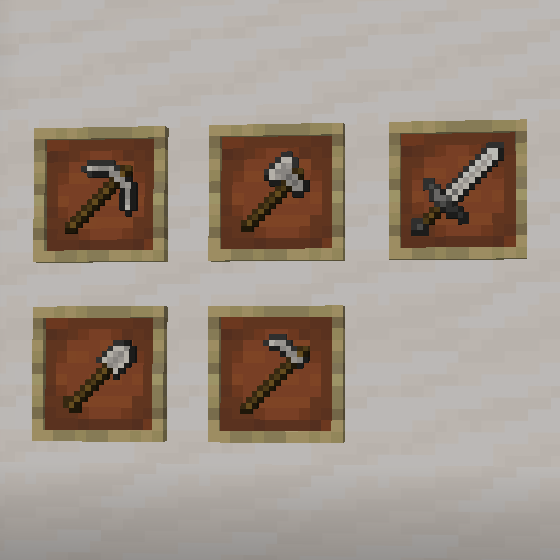

# Quartz Tools

A Fabric mod for Minecraft 1.21.11 that adds tools made from smooth quartz blocks.

## Features

Craft pickaxe, axe, shovel, hoe, and sword from smooth quartz blocks. Quartz tools are powerful but fragile - a glass cannon approach to tools.

### Tool Stats

| Stat | Quartz | Diamond |
|------|--------|---------|
| Durability | 128 | 1561 |
| Mining Speed | 10.0 | 8.0 |
| Attack Damage Bonus | +4.0 | +3.0 |
| Enchantability | 30 | 10 |

**Highlights:**
- Fastest mining speed in the game
- Highest damage bonus
- Triple the enchantability of diamond
- Very low durability (breaks fast)
- Crafted from smooth quartz blocks

## Screenshots

## Crafting

Standard tool crafting patterns using **Smooth Quartz Blocks** and sticks.

## Installation

1. Install [Fabric Loader](https://fabricmc.net/use/) for Minecraft 1.21.11
2. Download and install [Fabric API](https://modrinth.com/mod/fabric-api)
3. Download the latest release of Quartz Tools
4. Place the jar file in your `mods` folder

### Server-Side Installation

This mod works on servers with vanilla clients! When installed on a server:
- Vanilla clients will be prompted to download a resource pack
- If accepted, they see custom tool textures
- If declined, tools still function correctly

Polymer is bundled with the mod - no additional downloads required.

## Requirements

- Minecraft 1.21+
- Fabric Loader 0.15.0+
- Fabric API
- Polymer (bundled)

## License

This project is licensed under the MIT License - see the [LICENSE](LICENSE) file for details.
