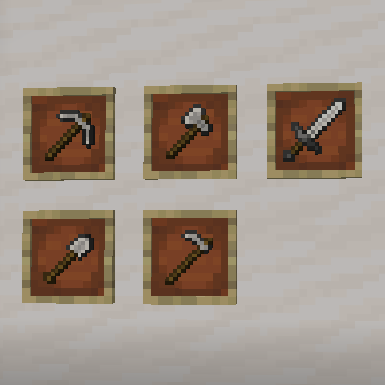

# Quartz Tools

A Fabric mod that adds a full set of tools (pickaxe, axe, shovel, hoe, and sword) crafted from smooth quartz blocks. Quartz tools hit harder and mine faster than diamond, and take enchantments exceptionally well, but they're fragile: a glass-cannon tool tier that trades durability for raw power.

## Screenshots

## Features

- Pickaxe, axe, shovel, hoe, and sword crafted from smooth quartz blocks and sticks using standard vanilla tool crafting patterns
- Mines anything diamond tools can mine (including obsidian)
- Mines faster than diamond or netherite (only gold is quicker), with an attack damage bonus equal to netherite's
- Triple the enchantability of diamond
- Very low durability: the tradeoff for the stat boost
- Repairable with smooth quartz blocks
- Added to the vanilla Tools and Combat creative tabs

### Tool Stats

| Stat | Quartz | Diamond |
|------|--------|---------|
| Durability | 128 | 1561 |
| Mining Speed | 10.0 | 8.0 |
| Attack Damage Bonus | +4.0 | +3.0 |
| Enchantability | 30 | 10 |

## Pandorical

Quartz Tools runs server-side, and Pandorical is required: the server will not load this mod without it. It syncs the tools' textures and models through Pandorical's content sync.

Clients are the optional half. A player on a Pandorical client sees the quartz textures and item names; a player on a vanilla client sees neither. The stats are identical either way.

## Development

Installing is in [DEVELOPMENT.md](DEVELOPMENT.md).

## License

MIT, see [LICENSE](LICENSE).
